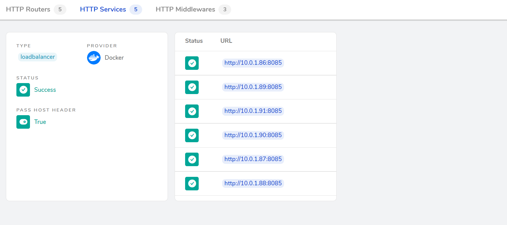

### Docker machine
Để cài đặt các máy ảo chạy docker daemon, sử dụng docker-machine.
Tạo 3 máy ảo với docker-machine
```
docker-machine create --driver virtualbox vps1
docker-machine create --driver virtualbox vps2
docker-machine create --driver virtualbox vps3
```
Kiểm tra máy ảo đã tạo
```
docker-machine ls
```
Kết quả
```
NAME   ACTIVE   DRIVER       STATE     URL                         SWARM   DOCKER      ERRORS
vps1   -        virtualbox   Running   tcp://192.168.99.100:2376           v19.03.12
vps2   -        virtualbox   Running   tcp://192.168.99.101:2376           v19.03.12
vps3   -        virtualbox   Running   tcp://192.168.99.102:2376           v19.03.12
```
### Docker swarm
Khởi tạo swarm, chỉ định vps1 là manager. Tại vps1 (docker-machine ssh vps1)
```
docker swarm init --advertise-addr=192.168.99.100
```
Tại các máy ảo khác, sử dụng lệnh đã trả về để join vào swarm hoặc kiểm tra lại bằng lệnh (kiểm tra token trên máy manager)
```
docker swarm join-token worker
```
### Chạy service trên swarm
Chạy một service với 5 replica, port 8085
```
docker service create --replicas 5 -p 8085:8085 --name testservice ichte/swarmtest:node
```
Kiểm tra service đã chạy
```
docker service ps 
```
Kết quả
```
ID                  NAME                IMAGE                  NODE                DESIRED STATE       CURRENT STATE
l6yxw55l1cn0        testservice.1       ichte/swarmtest:node   vps3                Running             Running 23 minutes ago   
5n1vdyuf0fc5        testservice.2       ichte/swarmtest:node   vps1                Running             Running 23 minutes ago   
bcsn1h1ckm4c        testservice.3       ichte/swarmtest:node   vps2                Running             Running 23 minutes ago   
k29rvucbb9wh        testservice.4       ichte/swarmtest:node   vps3                Running             Running 23 minutes ago   
t5uohh0ij49d        testservice.5       ichte/swarmtest:node   vps2                Running             Running 23 minutes ago   
```
Scale lên nhiều instance
```
docker service scale testservice=10
```
### Sử dụng traefik 
Trong docker compose file, khai báo service traefik chạy trên manager node
```
services:
  traefik:
    image: traefik:v2.10
    command:
      - "--api.insecure=true" 
      - "--providers.docker=true"
      - "--providers.docker.swarmMode=true"
      - "--entryPoints.web.address=:80"
      - "--entryPoints.websecure.address=:443"
      - "--certificatesResolvers.myresolver.acme.httpChallenge.entryPoint=web" # Xác thực qua HTTP challenge
      - "--certificatesResolvers.myresolver.acme.email=you@example.com" # Email để nhận thông báo về SSL
      - "--certificatesResolvers.myresolver.acme.storage=/letsencrypt/acme.json" # Lưu trữ trạng thái của Let's Encrypt
    ports:
      - "80:80"
      - "443:443"
      - "8080:8080"
    volumes:
      - "/var/run/docker.sock:/var/run/docker.sock:ro"
      - "traefik-certificates:/letsencrypt"
    networks:
      - traefik-public
    deploy:
      replicas: 1
      placement:
        constraints:
          - node.role == manager
      labels:
        - "traefik.enable=true"
        - "traefik.http.routers.traefik.rule=Host(`traefik.localhost`)"
        - "traefik.http.routers.traefik.service=api@internal"
        - "traefik.http.routers.traefik.entrypoints=web,websecure" # Sử dụng cả HTTP và HTTPS
```
Cấu hình lại service swarmtest
```
  web:
    image: ichte/swarmtest:node
    networks:
      - traefik-public
    deploy:
      replicas: 5
      labels:
        - "traefik.enable=true"
        - "traefik.http.routers.web.rule=PathPrefix(`/web`)" 
        - "traefik.http.services.web.loadbalancer.server.port=8085" 
        - "traefik.http.routers.web.entrypoints=web,websecure" # Sử dụng cả HTTP và HTTPS
        - "traefik.http.middlewares.web-redirect.redirectscheme.scheme=https" # Chuyển hướng HTTP sang HTTPS
        - "traefik.http.routers.web-secure.rule=PathPrefix(`/web`)" # Định tuyến dựa trên URL PathPrefix
        - "traefik.http.routers.web-secure.entrypoints=websecure" # Chỉ dùng HTTPS cho router bảo mật
        - "traefik.http.routers.web-secure.tls.certresolver=myresolver" # Sử dụng Let's Encrypt để cấp phát chứng chỉ
```
Scale service
```
docker service scale test_web=6
```
Kết quả, nhận được 6 instance sau khi scale
